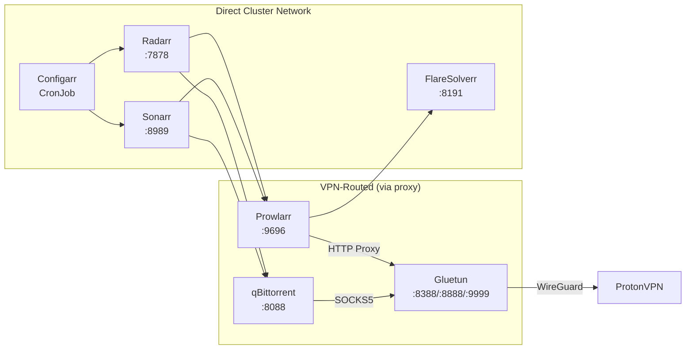

# Design Document: k8s-gitops-migration

## Overview

This design describes the migration of an existing Docker Compose media server stack to Kubernetes with GitOps delivery via Argo CD. The architecture preserves the existing storage layout (`/data/` hostPath mounts) and service routing (`*.zion.home` via Traefik) while introducing Kubernetes-native patterns.

The key architectural decision is the replacement of the Docker Compose `network_mode: service:gluetun` pattern (shared network namespace) with a SOCKS5/HTTP proxy approach. Instead of a "mega-pod" containing all VPN-dependent services, every service is its own independent Deployment. Gluetun runs standalone and exposes SOCKS5 (port 8388) and HTTP proxy (port 8888) endpoints. Services that need VPN routing (qBittorrent, Prowlarr) configure their proxy settings at the application level to point at Gluetun's ClusterIP Service.

The deployment uses a unified Kustomize approach:
- **Every directory under `k8s/` is a Kustomize application**
- **Helm chart inflation via Kustomize** for Argo CD, Traefik, and Jellyfin (using the `helmCharts` field in `kustomization.yaml` with local `values.yaml` files)
- **Standard Kustomize** for everything else (Gluetun, qBittorrent, Sonarr, Radarr, Prowlarr, FlareSolverr, Homarr, Jellyseerr, Configarr, storage, secrets, ConfigMaps)
- **Single ApplicationSet** with a Git directory generator for automatic application discovery — no exclusions needed
- **Argo CD sync waves** ensure storage/common (wave 0) are healthy before workloads (wave 1) deploy

The Argo CD repo server requires the `--enable-helm` flag for Kustomize Helm chart inflation to work.

Two namespaces isolate concerns: `argocd` for the control plane, `media` for all workloads.

## Architecture

### High-Level Architecture

```mermaid
graph TB
    subgraph "Git Repository"
        REPO[k8s/ directory]
        BOOTSTRAP[bootstrap/applicationset.yaml]
    end

    subgraph "argocd namespace"
        ARGOCD[Argo CD<br/>Kustomize + Helm Inflation]
        APPSET[ApplicationSet<br/>Git Directory Generator]
    end

    subgraph "media namespace"
        TRAEFIK[Traefik Ingress<br/>Kustomize + Helm Inflation]

        GLUETUN[Gluetun Proxy<br/>SOCKS5 :8388 / HTTP :8888]

        QBIT[qBittorrent<br/>SOCKS5 → Gluetun]
        PROWLARR[Prowlarr<br/>HTTP Proxy → Gluetun]
        FLARESOLVERR[FlareSolverr<br/>Internal Only]

        SONARR[Sonarr<br/>No VPN needed]
        RADARR[Radarr<br/>No VPN needed]

        JELLYFIN[Jellyfin<br/>Kustomize + Helm Inflation]
        JELLYSEERR[Jellyseerr<br/>Kustomize]
        HOMARR[Homarr<br/>Kustomize]
        CONFIGARR[Configarr CronJob<br/>Kustomize]
    end

    subgraph "Host Storage /data/"
        MEDIA[/data/media]
        TORRENTS[/data/torrents]
        appdata[/data/appdata/*]
    end

    REPO --> ARGOCD
    ARGOCD --> APPSET
    APPSET -->|auto-discovers| TRAEFIK
    APPSET -->|auto-discovers| GLUETUN
    APPSET -->|auto-discovers| QBIT
    APPSET -->|auto-discovers| SONARR
    APPSET -->|auto-discovers| RADARR
    APPSET -->|auto-discovers| PROWLARR
    APPSET -->|auto-discovers| FLARESOLVERR
    APPSET -->|auto-discovers| JELLYFIN
    APPSET -->|auto-discovers| JELLYSEERR
    APPSET -->|auto-discovers| HOMARR
    APPSET -->|auto-discovers| CONFIGARR

    TRAEFIK -->|bittorrent.zion.home| QBIT
    TRAEFIK -->|sonarr.zion.home| SONARR
    TRAEFIK -->|radarr.zion.home| RADARR
    TRAEFIK -->|prowlarr.zion.home| PROWLARR
    TRAEFIK -->|jellyfin.zion.home| JELLYFIN
    TRAEFIK -->|jellyseerr.zion.home| JELLYSEERR
    TRAEFIK -->|zion.home| HOMARR

    QBIT -->|SOCKS5 :8388| GLUETUN
    PROWLARR -->|HTTP Proxy :8888| GLUETUN
    PROWLARR -->|challenge solving| FLARESOLVERR
    GLUETUN -.->|WireGuard| PROTON[ProtonVPN]

    SONARR -->|download client| QBIT
    SONARR -->|indexer| PROWLARR
    RADARR -->|download client| QBIT
    RADARR -->|indexer| PROWLARR

    CONFIGARR -.->|API| SONARR
    CONFIGARR -.->|API| RADARR
```

### Service Communication Map



### Repository Directory Structure

The Git directory generator requires a flat directory layout under a known path. Each subdirectory becomes an Argo CD Application.

```
k8s/
├── argocd/                    # Kustomize + Helm inflation: Argo CD (syncs to argocd namespace)
│   ├── kustomization.yaml
│   └── values.yaml
├── traefik/                   # Kustomize + Helm inflation: Traefik
│   ├── kustomization.yaml
│   └── values.yaml
├── gluetun/                   # Kustomize: Gluetun VPN proxy gateway
│   ├── kustomization.yaml
│   ├── deployment.yaml
│   └── service.yaml
├── qbittorrent/               # Kustomize: qBittorrent (uses SOCKS5 proxy to Gluetun)
│   ├── kustomization.yaml
│   ├── deployment.yaml
│   ├── service.yaml
│   └── ingress.yaml
├── sonarr/                    # Kustomize: Sonarr (no VPN needed)
│   ├── kustomization.yaml
│   ├── deployment.yaml
│   ├── service.yaml
│   └── ingress.yaml
├── radarr/                    # Kustomize: Radarr (no VPN needed)
│   ├── kustomization.yaml
│   ├── deployment.yaml
│   ├── service.yaml
│   └── ingress.yaml
├── prowlarr/                  # Kustomize: Prowlarr (uses HTTP proxy to Gluetun)
│   ├── kustomization.yaml
│   ├── deployment.yaml
│   ├── service.yaml
│   └── ingress.yaml
├── flaresolverr/              # Kustomize: FlareSolverr (internal only, no ingress)
│   ├── kustomization.yaml
│   ├── deployment.yaml
│   └── service.yaml
├── jellyfin/                  # Kustomize + Helm inflation: Jellyfin
│   ├── kustomization.yaml
│   └── values.yaml
├── jellyseerr/                # Kustomize: Jellyseerr deployment
│   ├── kustomization.yaml
│   ├── deployment.yaml
│   ├── service.yaml
│   └── ingress.yaml
├── homarr/                    # Kustomize: Homarr dashboard
│   ├── kustomization.yaml
│   ├── deployment.yaml
│   ├── service.yaml
│   └── ingress.yaml
├── configarr/                 # Kustomize: Configarr CronJob
│   ├── kustomization.yaml
│   ├── cronjob.yaml
│   └── configmap.yaml
├── storage/                   # Kustomize: PVs and PVCs (sync wave 0)
│   ├── kustomization.yaml
│   └── persistent-volumes.yaml
└── common/                    # Kustomize: shared ConfigMap + secrets placeholder (sync wave 0)
    ├── kustomization.yaml
    ├── configmap-common-env.yaml
    └── secrets-placeholder.yaml
bootstrap/
├── applicationset.yaml        # Bootstrap: applied manually once
└── namespace.yaml             # Bootstrap: creates argocd + media namespaces
```

The `bootstrap/` directory is applied manually during initial cluster setup and is NOT managed by the ApplicationSet (it creates the ApplicationSet itself).

Every directory under `k8s/` contains a `kustomization.yaml` and is discovered by the single Git directory generator. For Helm-based apps (argocd, traefik, jellyfin), the `kustomization.yaml` uses the `helmCharts` field to inflate the Helm chart with a local `values.yaml`. Argo CD runs `kustomize build` uniformly on every directory — no special handling needed.

### Sync Wave Strategy

Argo CD sync waves control deployment ordering. Resources with lower wave numbers are synced first and must be healthy before higher waves begin.

| Wave | Directories | Contents | Rationale |
|------|-------------|----------|-----------|
| 0 | `k8s/storage/`, `k8s/common/` | PVs, PVCs, ConfigMaps, secret placeholders | Workloads depend on volumes and config being available |
| 1 | All other `k8s/` directories | Gluetun, qBittorrent, Sonarr, Radarr, Prowlarr, FlareSolverr, Jellyfin, Jellyseerr, Homarr, Traefik, Configarr | Workloads that consume wave 0 resources |

Sync waves are applied via the `argocd.argoproj.io/sync-wave` annotation on resources within each directory's manifests.

### Bootstrap Process

1. Create the cluster (assumed pre-existing)
2. `kubectl apply -f bootstrap/namespace.yaml` — creates `argocd` and `media` namespaces
3. Create secrets manually:
   - `kubectl create secret generic wireguard-private-key -n media --from-file=WIREGUARD_PRIVATE_KEY=./secrets/wireguard-private-key.secret`
   - `kubectl create secret generic homarr-encryption-key -n media --from-file=SECRET_ENCRYPTION_KEY=./secrets/homarr-encryption-key.secret`
4. Bootstrap Argo CD via Kustomize (one-time manual step):
   ```bash
   kustomize build --enable-helm k8s/argocd | kubectl apply -n argocd -f -
   ```
5. `kubectl apply -f bootstrap/applicationset.yaml` — creates the single ApplicationSet that auto-discovers everything under `k8s/`
6. Argo CD syncs wave 0 (storage, common) first, then wave 1 (all workloads), becoming self-managing

## Components and Interfaces

### ApplicationSet Configuration

A single ApplicationSet in `bootstrap/applicationset.yaml` handles all applications uniformly. Every directory under `k8s/` is a Kustomize application — no exclusions, no Helm/Kustomize split:

```yaml
apiVersion: argoproj.io/v1alpha1
kind: ApplicationSet
metadata:
  name: cluster-apps
  namespace: argocd
spec:
  generators:
    - git:
        repoURL: <this-git-repo-url>
        revision: HEAD
        directories:
          - path: k8s/*
  template:
    metadata:
      name: "{{path.basename}}"
    spec:
      project: default
      source:
        repoURL: <this-git-repo-url>
        targetRevision: HEAD
        path: "{{path}}"
      destination:
        server: https://kubernetes.default.svc
        namespace: media
      syncPolicy:
        automated:
          prune: true
          selfHeal: true
        syncOptions:
          - CreateNamespace=false
```

The `argocd` directory needs to deploy to the `argocd` namespace instead of `media`. This is handled by the `kustomization.yaml` in `k8s/argocd/` setting `namespace: argocd` explicitly, which overrides the ApplicationSet default.

Adding a new application is as simple as creating a new directory under `k8s/` with a `kustomization.yaml`.

### Argo CD Kustomization (`k8s/argocd/kustomization.yaml`)

Uses Kustomize Helm chart inflation to deploy Argo CD. The `helmCharts` field pulls and templates the official chart with local values.

```yaml
apiVersion: kustomize.config.k8s.io/v1beta1
kind: Kustomization
namespace: argocd
helmCharts:
  - name: argo-cd
    repo: https://argoproj.github.io/argo-helm
    version: "7.*"
    releaseName: argocd
    namespace: argocd
    valuesFile: values.yaml
```

### Argo CD Values (`k8s/argocd/values.yaml`)

Tuned-down resource limits for a small single-repo deployment. Redis disabled, ApplicationSet controller enabled, `--enable-helm` on repo server.

```yaml
global:
  domain: argocd.zion.home

redis-ha:
  enabled: false

redis:
  enabled: false

server:
  resources:
    requests:
      cpu: 50m
      memory: 64Mi
    limits:
      cpu: 200m
      memory: 128Mi

repoServer:
  extraArgs:
    - --enable-helm
  resources:
    requests:
      cpu: 50m
      memory: 64Mi
    limits:
      cpu: 200m
      memory: 128Mi

controller:
  resources:
    requests:
      cpu: 100m
      memory: 128Mi
    limits:
      cpu: 500m
      memory: 256Mi

applicationSet:
  enabled: true
  resources:
    requests:
      cpu: 25m
      memory: 32Mi
    limits:
      cpu: 100m
      memory: 64Mi

configs:
  params:
    server.insecure: true  # TLS terminated at Traefik
    redis.server: ""       # Disable Redis connection attempts
```

The `--enable-helm` flag on the repo server is critical — without it, Kustomize Helm chart inflation will fail for all Helm-based applications (argocd, traefik, jellyfin).

### Traefik Kustomization (`k8s/traefik/kustomization.yaml`)

```yaml
apiVersion: kustomize.config.k8s.io/v1beta1
kind: Kustomization
namespace: media
helmCharts:
  - name: traefik
    repo: https://traefik.github.io/charts
    version: "36.*"
    releaseName: traefik
    namespace: media
    valuesFile: values.yaml
```

### Traefik Values (`k8s/traefik/values.yaml`)

```yaml
deployment:
  replicas: 1

ingressClass:
  enabled: true
  isDefaultClass: true

providers:
  kubernetesIngress:
    enabled: true
  kubernetesCRD:
    enabled: true

ports:
  web:
    port: 8000
    exposedPort: 80
    protocol: TCP
  websecure:
    port: 8443
    exposedPort: 443
    protocol: TCP

service:
  type: LoadBalancer

logs:
  general:
    level: DEBUG

healthcheck:
  enabled: true
```

### Jellyfin Kustomization (`k8s/jellyfin/kustomization.yaml`)

```yaml
apiVersion: kustomize.config.k8s.io/v1beta1
kind: Kustomization
namespace: media
helmCharts:
  - name: jellyfin
    repo: https://jellyfin.github.io/jellyfin-helm
    version: "2.*"
    releaseName: jellyfin
    namespace: media
    valuesFile: values.yaml
```

### Jellyfin Values (`k8s/jellyfin/values.yaml`)

Based on the official `jellyfin/jellyfin` Helm chart from `https://jellyfin.github.io/jellyfin-helm`.

```yaml
image:
  repository: jellyfin/jellyfin

securityContext:
  runAsUser: 1000
  runAsGroup: 1000

extraEnvVars:
  - name: JELLYFIN_PublishedServerUrl
    value: "https://jellyfin.zion.home"
  - name: TZ
    value: "Etc/UTC"

persistence:
  config:
    enabled: true
    existingClaim: jellyfin-config-pvc
  cache:
    enabled: true
    existingClaim: jellyfin-cache-pvc

extraVolumes:
  - name: media
    persistentVolumeClaim:
      claimName: media-pvc

extraVolumeMounts:
  - name: media
    mountPath: /media
    readOnly: true

ingress:
  enabled: true
  className: traefik
  hosts:
    - host: jellyfin.zion.home
      paths:
        - path: /
          pathType: Prefix

livenessProbe:
  httpGet:
    path: /health
    port: http
readinessProbe:
  httpGet:
    path: /health
    port: http
```

### Gluetun VPN Proxy Deployment (`k8s/gluetun/`)

Gluetun runs as a standalone Deployment exposing SOCKS5 and HTTP proxy endpoints. This replaces the sidecar pattern — VPN-dependent services connect to Gluetun via the cluster network instead of sharing a network namespace.

```yaml
# deployment.yaml
apiVersion: apps/v1
kind: Deployment
metadata:
  name: gluetun
  namespace: media
  annotations:
    argocd.argoproj.io/sync-wave: "1"
spec:
  replicas: 1
  selector:
    matchLabels:
      app: gluetun
  template:
    metadata:
      labels:
        app: gluetun
    spec:
      containers:
        - name: gluetun
          image: qmcgaw/gluetun
          ports:
            - containerPort: 8388
              name: socks5
            - containerPort: 8888
              name: http-proxy
            - containerPort: 9999
              name: health
          env:
            - name: VPN_SERVICE_PROVIDER
              value: "protonvpn"
            - name: VPN_TYPE
              value: "wireguard"
            - name: VPN_PORT_FORWARDING
              value: "on"
            - name: VPN_PORT_FORWARDING_PROVIDER
              value: "protonvpn"
            - name: PORT_FORWARD_ONLY
              value: "on"
            - name: FIREWALL_OUTBOUND_SUBNETS
              value: "192.168.1.0/24"
            - name: HTTPPROXY
              value: "on"
            - name: HTTPPROXY_LISTENING_ADDRESS
              value: ":8888"
            - name: SHADOWSOCKS
              value: "off"
            - name: SOCKS5
              value: "on"
            - name: SOCKS5_LISTENING_ADDRESS
              value: ":8388"
            - name: WIREGUARD_PRIVATE_KEY
              valueFrom:
                secretKeyRef:
                  name: wireguard-private-key
                  key: WIREGUARD_PRIVATE_KEY
          securityContext:
            capabilities:
              add:
                - NET_ADMIN
          volumeMounts:
            - name: tun-device
              mountPath: /dev/net/tun
            - name: gluetun-config
              mountPath: /gluetun
          readinessProbe:
            httpGet:
              path: /
              port: 9999
            initialDelaySeconds: 15
            periodSeconds: 10
          livenessProbe:
            httpGet:
              path: /
              port: 9999
            initialDelaySeconds: 30
            periodSeconds: 30
      volumes:
        - name: tun-device
          hostPath:
            path: /dev/net/tun
            type: CharDevice
        - name: gluetun-config
          persistentVolumeClaim:
            claimName: gluetun-config-pvc
```

```yaml
# service.yaml
apiVersion: v1
kind: Service
metadata:
  name: gluetun-svc
  namespace: media
spec:
  selector:
    app: gluetun
  ports:
    - name: socks5
      port: 8388
      targetPort: 8388
    - name: http-proxy
      port: 8888
      targetPort: 8888
    - name: health
      port: 9999
      targetPort: 9999
```

No Ingress is needed — Gluetun is an internal-only service. Other services reach it at `gluetun-svc.media.svc.cluster.local`.

### qBittorrent Deployment (`k8s/qbittorrent/`)

Independent Deployment using SOCKS5 proxy to Gluetun for peer connections.

```yaml
# deployment.yaml
apiVersion: apps/v1
kind: Deployment
metadata:
  name: qbittorrent
  namespace: media
  annotations:
    argocd.argoproj.io/sync-wave: "1"
spec:
  replicas: 1
  selector:
    matchLabels:
      app: qbittorrent
  template:
    metadata:
      labels:
        app: qbittorrent
    spec:
      containers:
        - name: qbittorrent
          image: lscr.io/linuxserver/qbittorrent:latest
          ports:
            - containerPort: 8088
          envFrom:
            - configMapRef:
                name: common-env
          env:
            - name: WEBUI_PORT
              value: "8088"
          volumeMounts:
            - name: config
              mountPath: /config
            - name: torrents
              mountPath: /downloads
          readinessProbe:
            httpGet:
              path: /
              port: 8088
            initialDelaySeconds: 30
            periodSeconds: 10
          livenessProbe:
            httpGet:
              path: /
              port: 8088
            initialDelaySeconds: 60
            periodSeconds: 30
      volumes:
        - name: config
          persistentVolumeClaim:
            claimName: bittorrent-config-pvc
        - name: torrents
          persistentVolumeClaim:
            claimName: torrents-pvc
```

qBittorrent's SOCKS5 proxy setting (`gluetun-svc.media.svc.cluster.local:8388`) is configured via the qBittorrent WebUI or its config file at `/config/qBittorrent/qBittorrent.conf` after first launch. This is an application-level setting, not a Kubernetes manifest concern.

```yaml
# service.yaml
apiVersion: v1
kind: Service
metadata:
  name: qbittorrent-svc
  namespace: media
spec:
  selector:
    app: qbittorrent
  ports:
    - name: webui
      port: 8088
      targetPort: 8088
```

```yaml
# ingress.yaml
apiVersion: networking.k8s.io/v1
kind: Ingress
metadata:
  name: qbittorrent-ingress
  namespace: media
spec:
  ingressClassName: traefik
  rules:
    - host: bittorrent.zion.home
      http:
        paths:
          - path: /
            pathType: Prefix
            backend:
              service:
                name: qbittorrent-svc
                port:
                  name: webui
```

### Sonarr Deployment (`k8s/sonarr/`)

Independent Deployment — no VPN proxy needed. Communicates with qBittorrent and Prowlarr via the cluster service network.

```yaml
# deployment.yaml
apiVersion: apps/v1
kind: Deployment
metadata:
  name: sonarr
  namespace: media
  annotations:
    argocd.argoproj.io/sync-wave: "1"
spec:
  replicas: 1
  selector:
    matchLabels:
      app: sonarr
  template:
    metadata:
      labels:
        app: sonarr
    spec:
      containers:
        - name: sonarr
          image: lscr.io/linuxserver/sonarr:latest
          ports:
            - containerPort: 8989
          envFrom:
            - configMapRef:
                name: common-env
          volumeMounts:
            - name: config
              mountPath: /config
            - name: media
              mountPath: /media
            - name: torrents
              mountPath: /downloads
          readinessProbe:
            httpGet:
              path: /ping
              port: 8989
            initialDelaySeconds: 30
            periodSeconds: 10
          livenessProbe:
            httpGet:
              path: /ping
              port: 8989
            initialDelaySeconds: 60
            periodSeconds: 30
      volumes:
        - name: config
          persistentVolumeClaim:
            claimName: sonarr-config-pvc
        - name: media
          persistentVolumeClaim:
            claimName: media-pvc
        - name: torrents
          persistentVolumeClaim:
            claimName: torrents-pvc
```

Sonarr connects to qBittorrent at `qbittorrent-svc.media.svc.cluster.local:8088` and Prowlarr at `prowlarr-svc.media.svc.cluster.local:9696` — configured in the Sonarr UI, not in Kubernetes manifests.

```yaml
# service.yaml
apiVersion: v1
kind: Service
metadata:
  name: sonarr-svc
  namespace: media
spec:
  selector:
    app: sonarr
  ports:
    - name: http
      port: 8989
      targetPort: 8989
```

```yaml
# ingress.yaml
apiVersion: networking.k8s.io/v1
kind: Ingress
metadata:
  name: sonarr-ingress
  namespace: media
spec:
  ingressClassName: traefik
  rules:
    - host: sonarr.zion.home
      http:
        paths:
          - path: /
            pathType: Prefix
            backend:
              service:
                name: sonarr-svc
                port:
                  name: http
```

### Radarr Deployment (`k8s/radarr/`)

Identical pattern to Sonarr — independent Deployment, no VPN proxy needed.

```yaml
# deployment.yaml
apiVersion: apps/v1
kind: Deployment
metadata:
  name: radarr
  namespace: media
  annotations:
    argocd.argoproj.io/sync-wave: "1"
spec:
  replicas: 1
  selector:
    matchLabels:
      app: radarr
  template:
    metadata:
      labels:
        app: radarr
    spec:
      containers:
        - name: radarr
          image: lscr.io/linuxserver/radarr:latest
          ports:
            - containerPort: 7878
          envFrom:
            - configMapRef:
                name: common-env
          volumeMounts:
            - name: config
              mountPath: /config
            - name: media
              mountPath: /media
            - name: torrents
              mountPath: /downloads
          readinessProbe:
            httpGet:
              path: /ping
              port: 7878
            initialDelaySeconds: 30
            periodSeconds: 10
          livenessProbe:
            httpGet:
              path: /ping
              port: 7878
            initialDelaySeconds: 60
            periodSeconds: 30
      volumes:
        - name: config
          persistentVolumeClaim:
            claimName: radarr-config-pvc
        - name: media
          persistentVolumeClaim:
            claimName: media-pvc
        - name: torrents
          persistentVolumeClaim:
            claimName: torrents-pvc
```

```yaml
# service.yaml
apiVersion: v1
kind: Service
metadata:
  name: radarr-svc
  namespace: media
spec:
  selector:
    app: radarr
  ports:
    - name: http
      port: 7878
      targetPort: 7878
```

```yaml
# ingress.yaml
apiVersion: networking.k8s.io/v1
kind: Ingress
metadata:
  name: radarr-ingress
  namespace: media
spec:
  ingressClassName: traefik
  rules:
    - host: radarr.zion.home
      http:
        paths:
          - path: /
            pathType: Prefix
            backend:
              service:
                name: radarr-svc
                port:
                  name: http
```

### Prowlarr Deployment (`k8s/prowlarr/`)

Independent Deployment using HTTP proxy to Gluetun for indexer requests.

```yaml
# deployment.yaml
apiVersion: apps/v1
kind: Deployment
metadata:
  name: prowlarr
  namespace: media
  annotations:
    argocd.argoproj.io/sync-wave: "1"
spec:
  replicas: 1
  selector:
    matchLabels:
      app: prowlarr
  template:
    metadata:
      labels:
        app: prowlarr
    spec:
      containers:
        - name: prowlarr
          image: lscr.io/linuxserver/prowlarr:latest
          ports:
            - containerPort: 9696
          envFrom:
            - configMapRef:
                name: common-env
          volumeMounts:
            - name: config
              mountPath: /config
          readinessProbe:
            httpGet:
              path: /ping
              port: 9696
            initialDelaySeconds: 30
            periodSeconds: 10
          livenessProbe:
            httpGet:
              path: /ping
              port: 9696
            initialDelaySeconds: 60
            periodSeconds: 30
      volumes:
        - name: config
          persistentVolumeClaim:
            claimName: prowlarr-config-pvc
```

Prowlarr's HTTP proxy setting (`gluetun-svc.media.svc.cluster.local:8888`) is configured in the Prowlarr UI under Settings → General → Proxy. This routes indexer requests through the VPN tunnel. FlareSolverr is configured in Prowlarr as an indexer proxy pointing to `flaresolverr-svc.media.svc.cluster.local:8191`.

```yaml
# service.yaml
apiVersion: v1
kind: Service
metadata:
  name: prowlarr-svc
  namespace: media
spec:
  selector:
    app: prowlarr
  ports:
    - name: http
      port: 9696
      targetPort: 9696
```

```yaml
# ingress.yaml
apiVersion: networking.k8s.io/v1
kind: Ingress
metadata:
  name: prowlarr-ingress
  namespace: media
spec:
  ingressClassName: traefik
  rules:
    - host: prowlarr.zion.home
      http:
        paths:
          - path: /
            pathType: Prefix
            backend:
              service:
                name: prowlarr-svc
                port:
                  name: http
```

### FlareSolverr Deployment (`k8s/flaresolverr/`)

Internal-only Deployment — no VPN proxy, no Ingress. Prowlarr connects to it directly.

```yaml
# deployment.yaml
apiVersion: apps/v1
kind: Deployment
metadata:
  name: flaresolverr
  namespace: media
  annotations:
    argocd.argoproj.io/sync-wave: "1"
spec:
  replicas: 1
  selector:
    matchLabels:
      app: flaresolverr
  template:
    metadata:
      labels:
        app: flaresolverr
    spec:
      containers:
        - name: flaresolverr
          image: ghcr.io/flaresolverr/flaresolverr:latest
          ports:
            - containerPort: 8191
          env:
            - name: LOG_LEVEL
              value: "info"
            - name: LOG_HTML
              value: "false"
            - name: CAPTCHA_SOLVER
              value: "none"
            - name: TZ
              value: "UTC"
          readinessProbe:
            httpGet:
              path: /health
              port: 8191
            initialDelaySeconds: 30
            periodSeconds: 10
          livenessProbe:
            httpGet:
              path: /health
              port: 8191
            initialDelaySeconds: 60
            periodSeconds: 30
```

```yaml
# service.yaml
apiVersion: v1
kind: Service
metadata:
  name: flaresolverr-svc
  namespace: media
spec:
  selector:
    app: flaresolverr
  ports:
    - name: http
      port: 8191
      targetPort: 8191
```

### Jellyseerr Deployment (`k8s/jellyseerr/`)

```yaml
# deployment.yaml
apiVersion: apps/v1
kind: Deployment
metadata:
  name: jellyseerr
  namespace: media
  annotations:
    argocd.argoproj.io/sync-wave: "1"
spec:
  replicas: 1
  selector:
    matchLabels:
      app: jellyseerr
  template:
    metadata:
      labels:
        app: jellyseerr
    spec:
      containers:
        - name: jellyseerr
          image: fallenbagel/jellyseerr:latest
          ports:
            - containerPort: 5055
          env:
            - name: LOG_LEVEL
              value: "debug"
            - name: TZ
              value: "Etc/UTC"
          volumeMounts:
            - name: config
              mountPath: /app/config
          readinessProbe:
            httpGet:
              path: /
              port: 5055
            initialDelaySeconds: 30
            periodSeconds: 10
      initContainers:
        - name: wait-for-jellyfin
          image: busybox:1.36
          command: ['sh', '-c', 'until wget -q --spider http://jellyfin.media.svc.cluster.local:8096/health; do sleep 5; done']
      volumes:
        - name: config
          persistentVolumeClaim:
            claimName: jellyseerr-config-pvc
```

### Homarr Deployment (`k8s/homarr/`)

```yaml
# deployment.yaml
apiVersion: apps/v1
kind: Deployment
metadata:
  name: homarr
  namespace: media
  annotations:
    argocd.argoproj.io/sync-wave: "1"
spec:
  replicas: 1
  selector:
    matchLabels:
      app: homarr
  template:
    metadata:
      labels:
        app: homarr
    spec:
      containers:
        - name: homarr
          image: ghcr.io/homarr-labs/homarr:latest
          ports:
            - containerPort: 7575
          env:
            - name: SECRET_ENCRYPTION_KEY
              valueFrom:
                secretKeyRef:
                  name: homarr-encryption-key
                  key: SECRET_ENCRYPTION_KEY
          volumeMounts:
            - name: appdata
              mountPath: /appdata
          readinessProbe:
            httpGet:
              path: /
              port: 7575
            initialDelaySeconds: 30
            periodSeconds: 10
          livenessProbe:
            httpGet:
              path: /
              port: 7575
            initialDelaySeconds: 60
            periodSeconds: 30
      volumes:
        - name: appdata
          persistentVolumeClaim:
            claimName: homarr-config-pvc
```

Homarr Ingress routes `zion.home` (root domain) to port 7575.

### Configarr CronJob (`k8s/configarr/`)

Configarr runs as a CronJob that periodically applies TRaSH-Guides quality profiles to Sonarr and Radarr via their APIs. Now connects to Sonarr and Radarr as independent services.

```yaml
# cronjob.yaml
apiVersion: batch/v1
kind: CronJob
metadata:
  name: configarr
  namespace: media
  annotations:
    argocd.argoproj.io/sync-wave: "1"
spec:
  schedule: "0 */6 * * *"  # Every 6 hours
  jobTemplate:
    spec:
      template:
        spec:
          containers:
            - name: configarr
              image: configarr/configarr:latest
              volumeMounts:
                - name: config
                  mountPath: /app/config
              env:
                - name: SONARR_URL
                  value: "http://sonarr-svc.media.svc.cluster.local:8989"
                - name: RADARR_URL
                  value: "http://radarr-svc.media.svc.cluster.local:7878"
                - name: SONARR_API_KEY
                  valueFrom:
                    secretKeyRef:
                      name: configarr-api-keys
                      key: SONARR_API_KEY
                - name: RADARR_API_KEY
                  valueFrom:
                    secretKeyRef:
                      name: configarr-api-keys
                      key: RADARR_API_KEY
          restartPolicy: OnFailure
          volumes:
            - name: config
              configMap:
                name: configarr-config
```

The ConfigMap (`configarr-config`) contains the declarative YAML profile definitions referencing TRaSH-Guides profiles via the include mechanism from `https://configarr.de/docs/profiles/`.

### Sync Wave Annotations

Wave 0 resources (storage and common) use the annotation on their manifests:

```yaml
# In k8s/storage/persistent-volumes.yaml
apiVersion: v1
kind: PersistentVolume
metadata:
  name: media-pv
  annotations:
    argocd.argoproj.io/sync-wave: "0"
# ... (all PVs and PVCs in storage/ get wave 0)
```

```yaml
# In k8s/common/configmap-common-env.yaml
apiVersion: v1
kind: ConfigMap
metadata:
  name: common-env
  namespace: media
  annotations:
    argocd.argoproj.io/sync-wave: "0"
# ...
```

All workload Deployments, Services, Ingresses, and CronJobs use `argocd.argoproj.io/sync-wave: "1"` as shown in the individual component sections above.

## Data Models

### Persistent Volume / PersistentVolumeClaim Design (`k8s/storage/`)

All volumes use `hostPath` PersistentVolumes with `ReadWriteOnce` (or `ReadWriteMany` for shared volumes) access modes. Since this is a single-node cluster, `hostPath` is appropriate. Each volume is consumed by its own independent Deployment.

| PV/PVC Name              | Host Path                        | Access Mode     | Used By                                    |
|--------------------------|----------------------------------|-----------------|---------------------------------------------|
| media-pv / media-pvc     | /data/media                      | ReadWriteMany   | Jellyfin (RO), Sonarr, Radarr              |
| torrents-pv / torrents-pvc | /data/torrents                 | ReadWriteMany   | qBittorrent, Sonarr, Radarr                |
| gluetun-config-pv/pvc   | /data/appdata/gluetun        | ReadWriteOnce   | Gluetun                                     |
| bittorrent-config-pv/pvc | /data/appdata/bittorrent    | ReadWriteOnce   | qBittorrent                                 |
| sonarr-config-pv/pvc    | /data/appdata/sonarr         | ReadWriteOnce   | Sonarr                                      |
| radarr-config-pv/pvc    | /data/appdata/radarr         | ReadWriteOnce   | Radarr                                      |
| prowlarr-config-pv/pvc  | /data/appdata/prowlarr       | ReadWriteOnce   | Prowlarr                                    |
| jellyfin-config-pv/pvc  | /data/appdata/jellyfin       | ReadWriteOnce   | Jellyfin                                    |
| jellyfin-cache-pv/pvc   | /data/appdata/jellyfin_cache | ReadWriteOnce   | Jellyfin                                    |
| jellyseerr-config-pv/pvc| /data/appdata/jellyseerr     | ReadWriteOnce   | Jellyseerr                                  |
| homarr-config-pv/pvc    | /data/appdata/homarr         | ReadWriteOnce   | Homarr                                      |

Example PV/PVC pair:

```yaml
apiVersion: v1
kind: PersistentVolume
metadata:
  name: media-pv
  annotations:
    argocd.argoproj.io/sync-wave: "0"
spec:
  capacity:
    storage: 100Gi  # Nominal, hostPath doesn't enforce
  accessModes:
    - ReadWriteMany
  persistentVolumeReclaimPolicy: Retain
  storageClassName: ""
  hostPath:
    path: /data/media
    type: Directory
---
apiVersion: v1
kind: PersistentVolumeClaim
metadata:
  name: media-pvc
  namespace: media
  annotations:
    argocd.argoproj.io/sync-wave: "0"
spec:
  accessModes:
    - ReadWriteMany
  resources:
    requests:
      storage: 100Gi
  storageClassName: ""
  volumeName: media-pv
```

PVs are cluster-scoped (no namespace). PVCs are namespace-scoped and live in `media`. Each PVC explicitly binds to its PV via `volumeName` and empty `storageClassName` to avoid dynamic provisioning.

### Secrets Design

Secrets are created manually before deployment and are NOT stored in Git:

| Secret Name              | Namespace | Keys                    | Used By          |
|--------------------------|-----------|-------------------------|------------------|
| wireguard-private-key    | media     | WIREGUARD_PRIVATE_KEY   | Gluetun          |
| homarr-encryption-key    | media     | SECRET_ENCRYPTION_KEY   | Homarr           |
| configarr-api-keys       | media     | SONARR_API_KEY, RADARR_API_KEY | Configarr |

The repository contains a placeholder file (`k8s/common/secrets-placeholder.yaml`) documenting which secrets must exist:

```yaml
# secrets-placeholder.yaml
# These secrets must be created manually before deploying.
# DO NOT commit actual secret values to this repository.
#
# kubectl create secret generic wireguard-private-key -n media \
#   --from-file=WIREGUARD_PRIVATE_KEY=./secrets/wireguard-private-key.secret
#
# kubectl create secret generic homarr-encryption-key -n media \
#   --from-file=SECRET_ENCRYPTION_KEY=./secrets/homarr-encryption-key.secret
#
# kubectl create secret generic configarr-api-keys -n media \
#   --from-literal=SONARR_API_KEY=<your-sonarr-api-key> \
#   --from-literal=RADARR_API_KEY=<your-radarr-api-key>
```

### ConfigMap Design

**Common environment ConfigMap** (`k8s/common/configmap-common-env.yaml`):

```yaml
apiVersion: v1
kind: ConfigMap
metadata:
  name: common-env
  namespace: media
  annotations:
    argocd.argoproj.io/sync-wave: "0"
data:
  PUID: "1000"
  PGID: "1000"
  TZ: "Etc/UTC"
```

Referenced by qBittorrent, Sonarr, Radarr, and Prowlarr Deployments via `envFrom.configMapRef`.

FlareSolverr has its environment variables set directly in its Deployment spec (LOG_LEVEL, LOG_HTML, CAPTCHA_SOLVER, TZ) since they are specific to FlareSolverr and not shared.

Gluetun has its environment variables set directly in its Deployment spec since they include VPN-specific configuration and the secret reference.

## Error Handling

### VPN Connectivity Failure
- Gluetun exposes a health endpoint on port 9999. The Gluetun Deployment's readiness probe checks this endpoint.
- If Gluetun cannot establish the WireGuard tunnel, the pod fails its readiness check and the `gluetun-svc` Service stops routing traffic to it.
- VPN-dependent services (qBittorrent, Prowlarr) will fail to route traffic through the proxy but will continue running — their WebUIs remain accessible. This is a feature: operators can diagnose issues via the UI even when VPN is down.
- Gluetun's `restartPolicy: Always` (via the Deployment) ensures the pod restarts on crash.

### Individual Service Failure
- Each service is an independent Deployment with its own readiness/liveness probes. A failure in one service (e.g., Sonarr crashing) does NOT affect other services.
- This is a key advantage over the mega-pod pattern: previously, a crash in any container could destabilize the entire VPN pod.
- Kubernetes restarts individual failed pods without impacting the rest of the stack.

### Configarr Job Failure
- The CronJob uses `restartPolicy: OnFailure` — failed jobs are retried.
- Non-zero exit codes from Configarr (e.g., Sonarr/Radarr API unreachable) are surfaced in job logs.
- `backoffLimit: 3` prevents infinite retries.
- Configarr now connects to `sonarr-svc.media.svc.cluster.local:8989` and `radarr-svc.media.svc.cluster.local:7878` as independent services.

### Storage Unavailability
- hostPath volumes depend on the host filesystem. If `/data/` is unmounted or corrupted, pods will fail to start with volume mount errors.
- PV `persistentVolumeReclaimPolicy: Retain` ensures data is never deleted by Kubernetes.
- Sync wave 0 ensures PVs/PVCs are created and bound before any workload pod attempts to mount them.

### Argo CD Sync Failures
- Automated sync with `selfHeal: true` means Argo CD will continuously attempt to reconcile drift.
- If a manifest is invalid, Argo CD marks the Application as `OutOfSync` / `Degraded` — visible in the Argo CD UI.
- Sync wave ordering prevents workloads from deploying before their storage dependencies are ready.

### Service Dependency Ordering
- Jellyseerr uses an init container to wait for Jellyfin's `/health` endpoint before starting.
- Sync waves handle infrastructure-level ordering (storage before workloads).
- Application-level dependencies (e.g., qBittorrent needing Gluetun proxy) are handled gracefully: if the proxy is unavailable, the application still starts but VPN-routed traffic fails. This is acceptable — the service becomes fully functional once Gluetun is healthy.

## Testing Strategy

### PBT Applicability Assessment

Property-based testing is **NOT applicable** to this feature. The entire migration consists of:
- Kubernetes manifest YAML (Deployments, Services, Ingresses, PVs, PVCs, ConfigMaps, CronJobs)
- Helm value files (declarative configuration overrides)
- Kustomize overlays (declarative manifest composition)
- ApplicationSet templates (Argo CD custom resources)

This is Infrastructure as Code — declarative configuration with no custom application logic, no parsers, no data transformations, and no functions with input/output behavior. There are no universal properties that hold across a wide input space. PBT is designed for testing code logic, not infrastructure declarations.

### Recommended Testing Approach

**1. Schema / Lint Validation**
- `kubectl --dry-run=client -f <manifest>` for each generated manifest to validate syntax
- `kustomize build --enable-helm k8s/<app>` to verify all Kustomize applications render correctly (including Helm-inflated ones)
- `kubeval` or `kubeconform` for Kubernetes schema validation

**2. Smoke Tests (post-deployment)**
- Verify all pods in `media` and `argocd` namespaces reach `Running` state
- Verify all Argo CD Applications reach `Synced` + `Healthy` status
- Verify Gluetun health endpoint responds on port 9999
- Verify each service is reachable via its `*.zion.home` hostname through Traefik
- Verify sync wave 0 resources (PVs, PVCs, ConfigMaps) are created before wave 1 workloads

**3. Integration Tests (post-deployment)**
- Verify Traefik routes `bittorrent.zion.home` → qBittorrent WebUI (HTTP 200)
- Verify Traefik routes `sonarr.zion.home` → Sonarr (HTTP 200 on `/ping`)
- Verify Traefik routes `radarr.zion.home` → Radarr (HTTP 200 on `/ping`)
- Verify Traefik routes `prowlarr.zion.home` → Prowlarr (HTTP 200 on `/ping`)
- Verify Traefik routes `jellyfin.zion.home` → Jellyfin (HTTP 200 on `/health`)
- Verify Traefik routes `jellyseerr.zion.home` → Jellyseerr (HTTP 200)
- Verify Traefik routes `zion.home` → Homarr (HTTP 200)
- Verify qBittorrent SOCKS5 proxy is configured to `gluetun-svc.media.svc.cluster.local:8388`
- Verify Prowlarr HTTP proxy is configured to `gluetun-svc.media.svc.cluster.local:8888`
- Verify qBittorrent has external IP different from host IP (VPN tunnel active via proxy)
- Verify Configarr CronJob completes successfully and profiles are applied to Sonarr/Radarr

**4. Manifest Diff / Snapshot Tests**
- `kustomize build --enable-helm` output can be snapshot-tested to detect unintended changes
- Argo CD's own diff view provides continuous drift detection

**5. Rollback Verification**
- Verify that reverting a Git commit causes Argo CD to sync back to the previous state
- Verify that deleting an application directory causes the ApplicationSet to remove the corresponding Application

**6. Independent Service Isolation Tests**
- Verify that stopping/restarting one service (e.g., Sonarr) does not affect other services
- Verify that Gluetun failure does not prevent qBittorrent/Prowlarr WebUIs from loading (only VPN-routed traffic fails)
- Verify that each Deployment can be scaled independently
